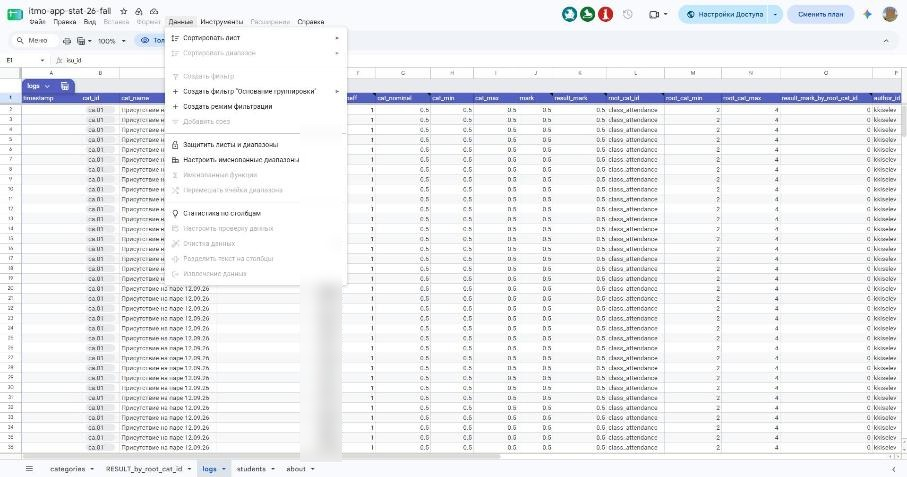
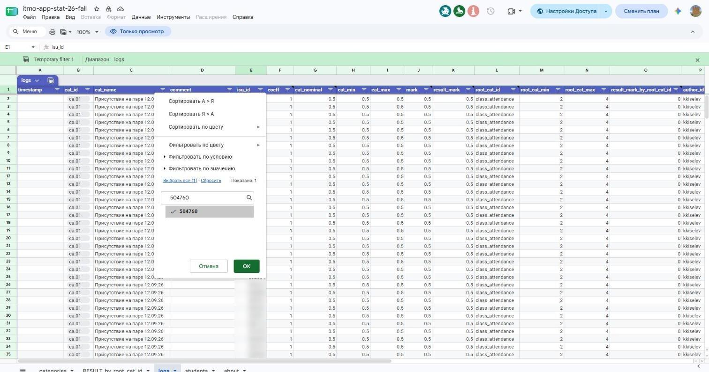
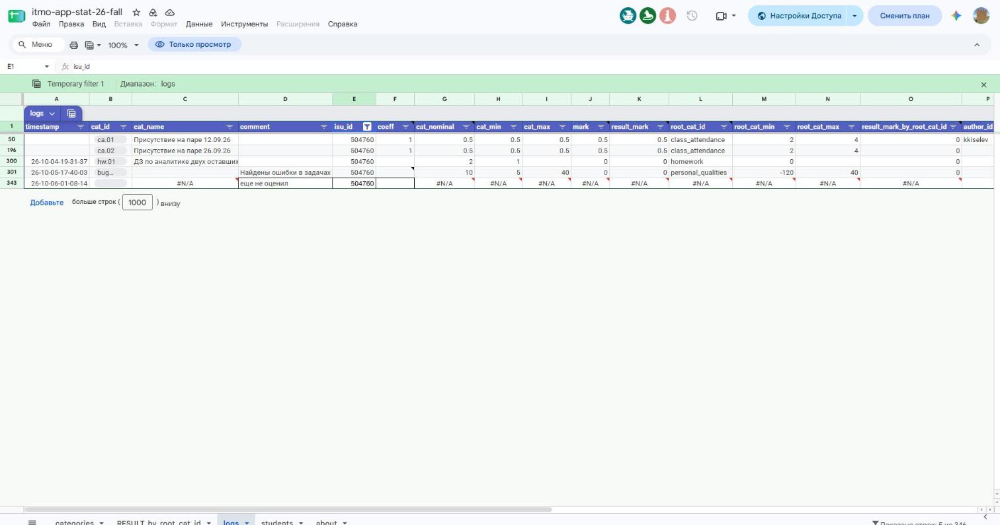
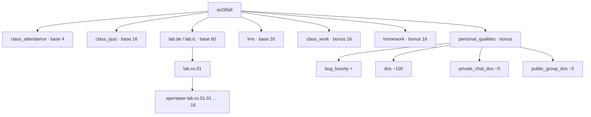

# Как читать журнал «Прикладная статистика, осень 2026» — v1

> Версия **v1** от 09.10.2026

Журнал: [itmo-app-stat-26-fall](https://docs.google.com/spreadsheets/d/1ATBKHrTjZsGwQ-6YRP0aZvUvSSKBNRze7YlqbAEJC60/edit)

Журнал устроен не как привычная ведомость «студент × задание», а как маленькая скоринговая система: есть **справочник категорий**, **лог всех оценок** и **сводная таблица**, которая собирается из лога автоматически. Ниже — что где лежит и как найти свои баллы.

> [!TIP]
> Коротко: свой итог смотрите на листе **RESULT_by_root_cat_id**, подробности по каждой оценке и комментарий преподавателя — на листе **logs** (фильтр по своему `isu_id`).

---

## Содержание

- [Листы журнала](#листы-журнала)
- [Как найти свои баллы](#как-найти-свои-баллы)
- [Как считается оценка](#как-считается-оценка)
- [Лист categories](#лист-categories)
- [Дерево категорий](#дерево-категорий)
- [Лист logs](#лист-logs)
- [Лист students](#лист-students)
- [Дедлайны](#дедлайны)
- [Штрафы и личные качества](#штрафы-и-личные-качества)
- [Перевод в итоговую оценку](#перевод-в-итоговую-оценку)
- [Частые вопросы](#частые-вопросы)

---

## Листы журнала

| Лист | Что внутри | Зачем смотреть |
|---|---|---|
| `about` | Описание листов, шкала оценок, планы развития журнала (todo) | Один раз прочитать |
| `categories` | Справочник: все виды работ, их стоимость, пороги и дедлайны | Узнать, сколько стоит работа и до какого числа её сдать |
| `logs` | Каждая выставленная оценка — отдельная строка с комментарием | Посмотреть оценку и отзыв по конкретной работе |
| `RESULT_by_root_cat_id` | Сводная таблица: студент × корневая категория | Посмотреть итог (это то, что уходит в БАРС) |
| `students` | Список студентов, поток, группа лабораторных, попытки апелляции | Узнать свой `isu_id` и поток |

---

## Как найти свои баллы

1. Узнайте свой **ISU ID** (номер в ИСУ, шесть цифр) — по нему, а не по ФИО, ищутся оценки в `logs` и в сводной.
2. Откройте `RESULT_by_root_cat_id` и найдите строку со своим ISU ID — там суммы по корневым категориям (посещение, опросы, лабы и т. д.).
3. Чтобы понять, откуда взялась сумма, откройте `logs` → *Данные → Фильтр* → в столбце `isu_id` оставьте свой номер. В столбце `сomment` — отзыв преподавателя.
4. Чтобы понять, сколько ещё можно набрать, смотрите `categories`: столбцы `nominal`, `min`, `max`.

### Фильтр по своему ISU ID (таблица открыта только на просмотр — фильтр временный и виден только вам)

1. Лист `logs` → меню **Данные → Создать режим фильтрации**.

   

2. Значок фильтра в заголовке `isu_id` → **Сбросить** → в поиске ввести свой ISU ID → отметить его → **OK**.

   

3. Остаются только ваши строки: работа, коэффициент, баллы и комментарий.

   

Закрыть фильтр — крестик справа на зелёной полосе «Temporary filter».

> [!NOTE]
> Если в `logs` у вашей работы есть строка, но `coeff` пустой, а в комментарии «еще не оценил» — работа принята в очередь, но не проверена.

---

## Как считается оценка

Преподаватель ставит не балл, а **коэффициент** `coeff` (число от 0, верхней границы нет). Дальше всё считается формулами:

```
mark            = coeff × cat_nominal
result_mark     = 0,                     если mark < cat_min
                  min(mark, cat_max)     иначе
```

То есть:

- **`coeff = 1`** — работа выполнена ровно «на номинал».
- **`coeff > 1`** — сделано больше, чем требовалось (например, 3.0 за ДЗ с доп. заданием), но балл всё равно обрежется по `max`.
- **`coeff < 1`** — чего-то не хватило. Если получилось меньше `min` — за работу **0**.

Пример: ДЗ `hw.01` — номинал 2, минимум 1. Коэффициент 0.4 → 0.8 балла < 1 → **0**. Коэффициент 0.75 → 1.5 балла → засчитано.

Затем баллы суммируются по **корневой категории** (например, все опросы → `class_quiz`). У корневой категории тоже есть свой `min`: пока сумма по корню его не достигла, в столбце `result_mark_by_root_cat_id` будет 0 — «когда наберёте нужную сумму по корню, тогда здесь всё проставится».

---

## Лист categories

Каждая строка — категория оценивания. Категории вкладываются друг в друга через `root_cat_id`.

| Столбец | Значение |
|---|---|
| `cat_id` | Код категории: `cq.01` — опрос 1, `ca.01` — посещение 1, `hw.01` — ДЗ 1, `lab.de.01` — лабораторная 1 потока КТвД и т. д. |
| `desc` | Человеческое название (у будущих работ пока пусто) |
| `root_cat_id` | Родительская категория, в которую идут баллы |
| `type` | `base` — основная, `bonus` — сверх основной, `penalty` — штраф |
| `root_cat_coeff_nominal` | Доля от номинала родителя. Номинал считается как *номинал родителя × эта доля* |
| `nominal` | Сколько баллов стоит работа при `coeff = 1` |
| `min` | Порог: набрали меньше — ставится 0 |
| `max` | Потолок: больше этого не начислят |
| `publication_datetime` | Когда задание выдано |
| `days_to_soft_deadline` / `soft_deadline` | Мягкий дедлайн (дата считается сама: публикация + дни) |
| `days_to_hard_deadline` / `hard_deadline` | Жёсткий дедлайн |
| `review_deadline` | Срок ревью |

### Типы категорий

- **base** — основа. Сумма номиналов корневых base-категорий по потоку = **100**.
- **bonus** — плюсуется сверху к base.
- **penalty** — штраф. Применяется к своей корневой категории, но **ниже нуля сумма по корню не опускается**.

---

## Дерево категорий

Верхний уровень — курс `as26fall`. Под ним корневые категории:

| Корневая категория | Тип | Номинал | min | Что входит |
|---|---|---|---|---|
| `class_attendance` | base | 4 | 2 | Посещение пар `ca.01…ca.08`, по 0.5 |
| `class_quiz` | base | 16 | 0 | Опросы на паре `cq.01…cq.08`, номинал 2, максимум 3 (у `cq.02` — 5, «опрос на 30 минут») |
| `lab.de` *или* `lab.ic` | base | 60 | 0 | Лабораторные — **у каждого потока свои**: `lab.de` — поток КТвД, `lab.ic` — инфохимики |
| `lms` | base | 20 | **17** | Упражнения в LMS, примерная дата — 20.12.2026. Меньше 17 — вся категория = 0 |
| `class_work` | bonus | 16 | 0 | Работа на паре `cw.01…cw.08`, до 2 за пару |
| `homework` | bonus | 16 | 0 | Домашки `hw.01…hw.06`, номинал 2, минимум 1 |
| `personal_qualities` | bonus | — | −120 | Bug bounty, а также штрафы за DoS (см. ниже) |

**Base: 4 + 16 + 60 + 20 = 100.** Всё остальное — бонусы.



### Лабораторные: критерии внутри

Каждая лабораторная разложена на критерии (`lab.ic.01.01`, `lab.ic.01.02`, …). Набор одинаковый по смыслу:

- **base** — реализованы все методы/распределения, полнота описания каждого, приведены источники, промт-инжиниринг / споры с нейронками (выводы);
- **bonus** — доп. статистика, дополнительный метод (за каждый), собранный реальный датасет, автотесты, LM-ноутбук / конспект, **сдано до мягкого дедлайна** (+40 % номинала);
- **penalty** — выводы сгенерированы нейронкой (−20 %), не воспроизводится в среде (Jupyter Hub / Colab / Yandex Cloud, −20 %), полная генерация кода нейронкой (−100 %), копипаст (−100 %), **сдано после жёсткого дедлайна** (−40 %).

> [!IMPORTANT]
> Комментарий к критерию «Выводы сгенерированы нейронкой»: **фиксируйте итерацию-сессию работы в Git.** История коммитов — ваше доказательство, что работа сделана самостоятельно.

---

## Лист logs

Журнал событий: одна выставленная оценка = одна строка. После первых двух недель обкатки исправления вносятся **новой строкой**, а не правкой старой.

| Столбец | Значение |
|---|---|
| `timestamp` | Когда выставлено |
| `cat_id` / `cat_name` | Какая работа |
| `сomment` | Отзыв преподавателя — самое полезное место |
| `isu_id` | Ваш ISU ID |
| `coeff` | Ваша оценка-коэффициент (0 … +∞) |
| `cat_nominal`, `cat_min`, `cat_max` | Подтягиваются из `categories` |
| `mark` | `coeff × nominal` |
| `result_mark` | Итог с учётом порогов категории |
| `root_cat_id`, `root_cat_min`, `root_cat_max` | Корневая категория и её пороги |
| `result_mark_by_root_cat_id` | Итог с учётом порога корневой категории |
| `author_id` | Кто выставил |
| `update_timestamp` | Когда запись обновлена |

---

## Лист students

| Столбец | Значение |
|---|---|
| `isu_id`, `name` | ISU ID и ФИО |
| `stream_id` | Поток: 96160 — КТвД, 96161 и 96162 — инфохимики |
| `lab_group_id` | `de` или `ic` — определяет, какие лабораторные у вас |
| `base_coeff` | Коэффициент к сумме базовых оценок (сейчас у всех 1) |
| `appeal_attempts` | Сколько апелляций осталось (сейчас 4) |

**Апелляция**: после получения оценки за сданную работу можно попросить перепроверку. Количество ограничено, нужно обоснование, перепроверка идёт в общую очередь, **понижения балла не будет**.

---

## Дедлайны

- **Мягкий дедлайн** — сдали до него → бонус (у лабораторных +40 % номинала). Проставляется автоматически по дате сдачи, если набран минимум по корневой категории. Касается в основном homework и lab.
- **Жёсткий дедлайн** — после него штраф, и он растёт **по неделям** опоздания (коэффициент — дробное число недель). Чем позже, тем больше штраф.
- Даты считаются от `publication_datetime` + `days_to_*`. Если даты публикации ещё нет — задание не выдано.

Пример: `hw.01` опубликовано 26.09.2026 10:00, жёсткий дедлайн +7 дней = **03.10.2026 10:00**.

---

## Штрафы и личные качества

Категория `personal_qualities` — про поведение. Она может дать до +40, а может и уйти в минус.

| Категория | Баллы | Что это |
|---|---|---|
| `bug_bounty` | +10 за находку (до 40) | Нашли ошибку в задачах LMS или в журнале |
| `private_chat_dos` | −5 (до −20) | «Атака» личными сообщениями преподавателю: десятки сообщений, «проверьте, пожалуйста», «когда будут оценки» |
| `public_group_dos` | −5 (до −50) | Флуд в общем чате: стикеры, «революции», офтоп |
| `dos` | −100 | DoS-атака (комментарий автора: «Вычислю по IP!!!!!11!») |

Правила общения из комментариев к таблице:

- Формулируйте мысль **в одном-двух сообщениях**, используйте я-сообщения.
- Не торопите с проверкой — скорость от этого не растёт.
- В общем чате можно делиться проблемами и кружочками о том, как делаете лабы. Чат должен быть полезным. В крайнем случае — тегните преподавателя.

---

## Перевод в итоговую оценку

| Баллы за семестр | Оценка |
|---|---|
| > 90 | Отлично, A |
| (83; 90] | Хорошо, B |
| (74; 83] | Хорошо, C |
| (67; 74] | Удовлетворительно, D |
| [60; 67] | Удовлетворительно, E |
| < 60 | Неудовлетворительно, FX |

---

## Частые вопросы

**В сводной у меня 0 по посещению, хотя я был на паре.**
Скорее всего, не набран порог корневой категории (`class_attendance`: min = 2, это 4 пары по 0.5). Пока порог не набран, в `result_mark_by_root_cat_id` стоит 0. Сама оценка за пару видна в `logs` в столбце `result_mark`.

**Мне поставили 0.4, а в итоге ноль.**
`0.4 × 2 = 0.8`, а минимум для ДЗ — 1. Ниже минимума — 0.

**Почему коэффициент больше 1?**
За сверхзадачи. Но балл всё равно ограничен `max` категории.

**Где мои лабораторные?**
Смотрите `lab_group_id` в `students`: `de` — ваши лабы `lab.de.*`, `ic` — `lab.ic.*`.

**Что такое `lms` и почему там минимум 17?**
Упражнения в LMS дают 20 base-баллов. Минимум по корню — 17: если набрать меньше 17, **вся категория lms обнуляется** (0 из 20). Делайте упражнения LMS заранее.

---

*Журнал развивается: в планах автоматический timestamp, тип события в логе, очередь на проверку, «таблица обещаний», связка GitHub — ISU — Telegram и модель скоринга. Инструкция будет обновляться вместе с ним.*
